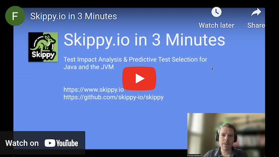

# skippy

Mono-repo for all Skippy projects.

## What is it?

Skippy is a Test Impact Analysis & Predictive Test Selection framework for Java and the JVM. It cuts down on unnecessary testing
and flakiness without compromising the integrity of your builds. You can run it from the command line, your favorite IDE
and continuous integration server. Skippy supports Gradle, Maven, JUnit 4 and JUnit 5.

Skippy is specifically designed to prevent regressions in your codebase.
It supports all types of tests where the tests and the code under test run in the same JVM.
It is best suited for deterministic tests, even those prone to occasional flakiness.
It provides the most value for test suites that are either slow or flaky (regardless of whether the test suite contains unit, integration, or functional tests).

[](http://www.youtube.com/watch?v=VZ_MmQI0mOA "Skippy.io in 3 minutes")

## What is it not?

Skippy is not designed for tests that assert the overall health of a system. Don't use it for tests you want to fail
in response to misbehaving services, infrastructure issues, etc.

## Highlights

- Support for Gradle & Maven
- Support for JUnit 4 & JUnit 5
- Lightweight: Use it from the command line, your favorite IDE and CI server
- Non-invasive: Use it for a single test, your entire suite and anything in-between
- Free of lock-in: You can go back to a "run everything" approach at any time
- Open Source under Apache 2 License

## Getting Started

The best way to get started are the [Introductory Tutorials](https://www.skippy.io/tutorials). From there, a good next
step is the [Reference Documentation](https://www.skippy.io/docs).

## Teaser

Let's take a whirlwind tour of Skippy, Gradle & JUnit 5. The concepts are similar for Maven & JUnit 4.

### Step 1: Install Skippy

```groovy
     plugins {
+        id 'io.skippy' version '0.0.24'
     }
    
     dependencies {
+        testImplementation 'io.skippy:skippy-junit5:0.0.24'
     }
```

### Step 2: Enable Predictive Test Selection

Annotate the test you want to optimize with `@PredictWithSkippy`:

```java
+    import io.skippy.junit5.PredictWithSkippy;

+    @PredictWithSkippy
     public class FooTest {     

         @Test
         public void testFoo() {
             assertEquals("foo", Foo.getFoo());
         }

     }
```

### Step 3: Skippy In Action

Run the tests:
```
./gradlew test

FooTest > testFoo() PASSED
BarTest > testBar() PASSED
```

Skippy performs a Test Impact Analysis every time you run a test. The result is stored in the .skippy folder:

```
ls -l .skippy

test-impact-analysis.json
```

This data allows Skippy to make intelligent skip-or-execute predictions. Let's see what happens when you run the tests again:

```
./gradlew test --rerun

FooTest > testFoo() SKIPPED
BarTest > testBar() SKIPPED
```

Skippy detects that nothing has changed and skips both tests.

Next, introduce a bug in class `Foo`:
```java
     class Foo {
    
         static String getFoo() {
-            return "foo";
+            return null;
         }
         
     }
```

Re-run the tests:

```
./gradlew test

FooTest > testFoo() FAILED
    org.opentest4j.AssertionFailedError: expected: <foo> but was: <null>
BarTest > testBar() SKIPPED
```

Skippy detects the change and executes `FooTest`. The regression is caught quickly - `BarTest` remains skipped.

Fix the bug and re-run the tests:

```
./gradlew test

FooTest > testFoo() PASSED
BarTest > testBar() SKIPPED
```

Skippy executes `FooTest` and updates the data in the .skippy folder.
Both tests will be skipped when you run them again:

```
./gradlew test --rerun

FooTest > testFoo() SKIPPED
BarTest > testBar() SKIPPED
```

## Use Skippy In Your CI Pipeline

It's safe to add the .skippy folder to version control. This will automatically enable Skippy's Predictive Test
Selection when your pipeline runs.

## Contributions & Issues

Contributions are always welcome! You can either
- submit a pull request,
- create an issue in
  [GitHub's issue tracker](https://github.com/skippy-io/skippy/issues) or
- email [contact@skippy.io](mailto:contact@skippy.io).

I would love to hear from you.

## Building Skippy Locally

You need JDK 17 or upwards to build Skippy.

If you want to run the entire build including tests, use `build`:

```
./gradlew build
```

If you want to publish all jars to your local Maven repository, use `publishToMavenLocal`:

```
./gradlew publishToMavenLocal
```

## Projects in this repo

This repo contains the following sub-projects:

- [skippy-core](skippy-core/README.md): Common functionality for all libraries in this repo
- [skippy-gradle](skippy-gradle/README.md): Skippy's Test Impact Analysis for Gradle
- [skippy-gradle-android](skippy-gradle-android/README.md): Skippy's Test Impact Analysis for Gradle & Android
- [skippy-maven](skippy-maven/README.md): Skippy's Test Impact Analysis for Maven
- [skippy-junit4](skippy-junit4/README.md): Skippy's Predictive Test Selection For JUnit 4
- [skippy-junit5](skippy-junit5/README.md): Skippy's Predictive Test Selection For JUnit 5
